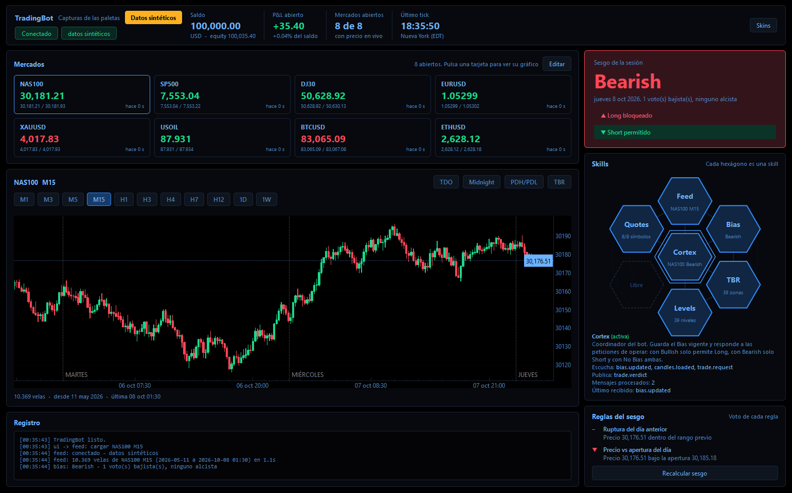
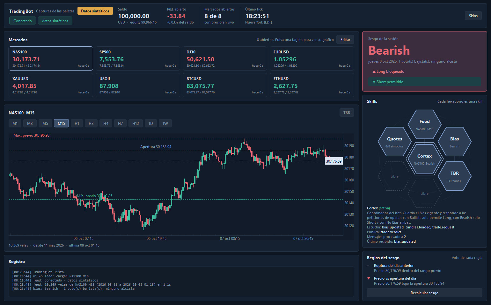
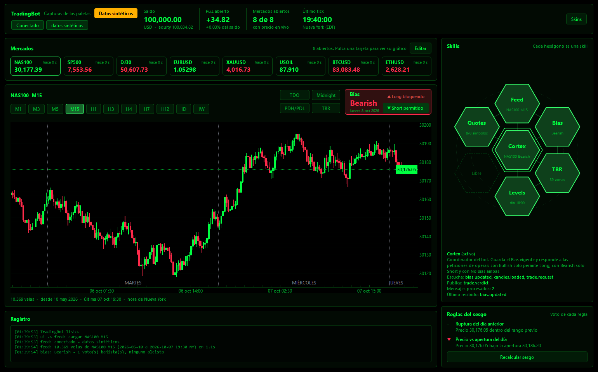
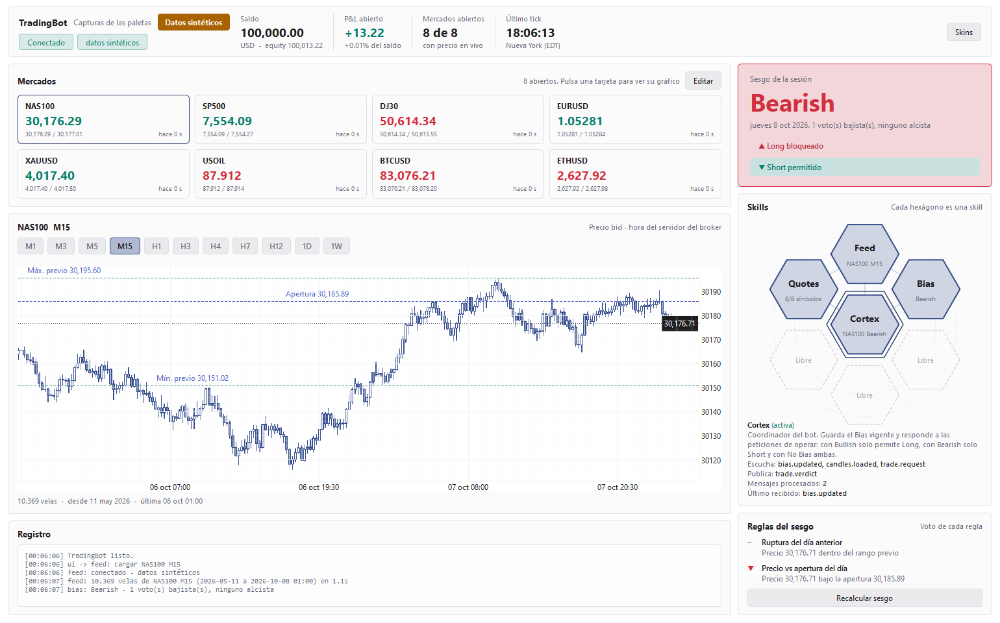

# TradingBot

Bot de trading con interfaz gráfica sobre MetaTrader 5. Esta primera versión incluye dos tareas y **no opera**:
no existe ninguna llamada para enviar órdenes, solo lectura de datos.

La interfaz sigue el estilo de la referencia visual: azul pizarra oscuro, paneles planos con borde fino,
tarjetas de mercado, gráfico de velas verde azulado/coral y, a la derecha, el sesgo del día.

| Tarea | Qué hace |
|---|---|
| Conexión y velas | Conecta con MT5 usando la cuenta del `.env` y carga todas las velas posibles en 1m, 3m, 5m o 15m (por defecto 15m). |
| Bias | Evalúa las reglas y decide el sesgo del día: **Bullish**, **Bearish** o **No Bias**. Se muestra en un recuadro fijo de la interfaz. |

Cabecera: estado de la conexión y cuenta; a continuación, saldo/equity, P&L abierto, mercados con precio en vivo y hora del último tick
**en hora de Nueva York**. MT5 entrega los ticks en la hora del servidor de tu broker; el bot mide el desfase de ese
servidor comparando los ticks en vivo con el reloj de tu PC (unos segundos tras conectar) y convierte a Nueva York
respetando el cambio de horario de EE. UU. Hasta que lo mide, la hora se marca como *(estimada)* y asume servidor = Nueva York + 7 h.
Pasa el ratón sobre la caja para ver la hora del servidor y el desfase detectado. Si no lo detecta bien (PC desincronizado),
fíjalo a mano con `QUOTES_SERVER_UTC_OFFSET` en `tradingbot.env`. Las horas del eje del gráfico siguen siendo las del servidor.

Panel **Mercados**: cotizaciones de solo lectura (se refrescan cada segundo; se cambia con `QUOTES_INTERVAL`). Con el botón **Editar** del panel eliges
qué mercados se muestran: busca entre los símbolos reales de tu broker (también por nombre común: *dow*, *nasdaq*,
*oro*, *petróleo*, *bitcoin*...), añade, quita y reordena. Se aplica al instante y se guarda en `settings.local.json`
(no se sube a git), que tiene prioridad sobre la `watchlist` de `config.toml`. Borrar ese fichero devuelve la lista de `config.toml`.
Pulsa una tarjeta para cargar su gráfico. Un símbolo cuyo último tick va más de 5 minutos por detrás del más
reciente se marca como *Mercado cerrado*, y uno que el broker no tiene aparece como *No disponible*.
Usa los nombres exactos de tu broker (en MT5: Ver > Símbolos).

Pinchar una tarjeta carga su gráfico (no hay selector de símbolo ni botón de cargar): para ver un símbolo nuevo,
añádelo primero con **Editar**. Si quitas el mercado que estás viendo, el gráfico carga el primero de la lista.

**Timeframes** (chips sobre el gráfico): M1, M3, M5, M15, H1, H3, H4, H7, H12, 1D y 1W. Cambiar de timeframe recarga el mercado actual.
- MT5 no tiene H7 (solo H1, H2, H3, H4, H6, H8 y H12). H7 se construye agrupando velas de 1 hora, alineadas con la
  medianoche de cada día (hora del servidor): 00-07, 07-14, 14-21 y 21-24, esta última más corta (3 horas).
- Con velas semanales (1W) el sesgo no se recalcula, porque "el día" no existe en ese timeframe: se conserva el último.

**TBR** (botón junto al título del gráfico): marca en el gráfico las zonas horarias del día, todas en hora de Nueva York.
Cada zona es una caja que va de su inicio a su final y de su Low a su High, con su color muy transparente para que se
sigan viendo las velas:

| Zona | Horario (NY) | Color |
|---|---|---|
| Asia | 20:00 - 00:00 | amarillo |
| London | 02:00 - 05:00 | rojo |
| Pre-NY | 09:00 - 10:00 | gris |
| NY-AM | 10:00 - 12:00 | verde |
| NY-PM | 13:30 - 16:30 | morado |

Para cada zona ya terminada dibuja tres niveles con su color: **High** y **Low** (línea continua) y **50 %** (punteada).
Cada nivel sale del borde derecho de la caja y se prolonga hasta la primera vela posterior que lo toca o lo atraviesa;
si ninguna lo ha tomado todavía, llega hasta el borde derecho del gráfico. Una zona en curso se pinta con el rango que
lleva hasta el momento; sus niveles aparecen al terminar.
- Horarios, colores, nombres, opacidad y días hacia atrás se cambian en el bloque **TBR** de `tradingbot.env`, donde
  también se pueden añadir zonas nuevas.
- Las velas llegan en hora del servidor del broker; las zonas se colocan con el desfase que mide Quotes (hasta medirlo
  se asume servidor = Nueva York + 7 h, lo habitual en Vantage).
- Solo se dibujan hasta H1 (`TBR_MAX_TF_MINUTES`): con velas más grandes las franjas no caben y el botón se desactiva.
  Con H1, la zona 13:30-16:30 incluye las velas que se solapan con ella (de 13:00 a 16:00).

**Niveles del día** (botones **TDO**, **Midnight** y **PDH/PDL**, junto a TBR). El día es el día de trading del broker,
el mismo que usa el Bias (en Vantage empieza a las 17:00 de Nueva York, y su primera vela, a las 18:00, es la apertura):

| Botón | Nivel | Línea |
|---|---|---|
| TDO | Apertura del mercado: precio de apertura de la primera vela del día | gris, discontinua |
| Midnight | Precio de apertura de la vela de las 00:00 de Nueva York | naranja, punteada |
| PDH/PDL | Máximo y mínimo del día de trading anterior (Previous Day High / Low) | azul, discontinua |

Cada nivel se dibuja desde su vela hasta el final de su día, con su nombre al final de la línea; los del día en curso
pasan un poco de la última vela. Además, una **línea vertical punteada** separa los días, con el nombre del día abajo
(LUNES, MARTES...). Todo se configura en el bloque **LEVELS** de `tradingbot.env` (botones activados al arrancar,
colores, días hacia atrás, separadores). Con velas diarias o semanales no se dibujan y los botones se desactivan.
Estos niveles sustituyen a las líneas fijas *Máx. previo*, *Mín. previo* y *Apertura* que antes pintaba el Bias
(el Bias sigue usando esos mismos valores en sus reglas).

Filtro de operativa: con **Bullish** solo se permiten operaciones alcistas (Long), con **Bearish** solo bajistas (Short), y con **No Bias** ambas. La futura capa de ejecución debe consultar `TradeFilter.check(direction)` antes de abrir cualquier trade.

## Requisitos

- Windows con MetaTrader 5 instalado, abierto y con la cuenta iniciada.
- [uv](https://docs.astral.sh/uv/) (`winget install astral-sh.uv`). Descarga Python 3.12 y las dependencias solo.

## Arranque

```powershell
cd C:\Users\claude\DEV\TradingBot
.\scripts\run.ps1              # cuenta por defecto del .env
.\scripts\run.ps1 --demo       # datos sintéticos: la interfaz funciona sin MT5
.\scripts\run.ps1 --profile real
```

Opciones: `--profile`, `--env RUTA`, `--symbol EURUSD`, `--timeframe 5m`, `--theme blanco`, `--demo` / `--no-demo`.
Mandan sobre `tradingbot.env` solo para esa vez (por ejemplo, `--no-demo` conecta con MT5 aunque `APP_DEMO=true`).

`run.ps1` hace, por este orden:
1. Lee `tradingbot.env` (ver abajo) y pasa sus valores a la app.
2. Si `APP_AUTO_UPDATE=true`, trae de GitHub el código nuevo (`git pull`) antes de arrancar.
3. Arranca la app con `uv`.

## Configuración (tradingbot.env)

`tradingbot.env`, en la raíz del proyecto, gobierna el arranque y las skills. Es texto `CLAVE=valor`, organizado
en bloques comentados, uno por skill o parte del bot. Cada clave empieza por el nombre de su bloque:

| Clave | Por defecto | Para qué |
|---|---|---|
| **APP** — arranque | | |
| `APP_AUTO_UPDATE` | `false` | Traer el código nuevo de GitHub (`git pull`) antes de arrancar (`true`/`false`). Lo lee `run.ps1`. |
| `APP_PROFILE` | vacío | Perfil de MT5 con el que conectar: el `<NOMBRE>` de `MT5_<NOMBRE>_LOGIN` del `.env` de cuentas. Vacío: el de `MT5_DEFAULT`. |
| `APP_DEMO` | `false` | `true`: datos sintéticos, sin conectar con MT5 (como `--demo`). |
| **FEED** — conexión y velas | | |
| `FEED_SYMBOL` | `EURUSD` | Mercado que se carga al arrancar. Nombre exacto del broker, con mayúsculas y sufijos (`NAS100FT.r`). |
| `FEED_TIMEFRAME` | `M15` | Timeframe al arrancar: `M1` `M3` `M5` `M15` `H1` `H3` `H4` `H7` `H12` `1D` `1W` (también vale `15m`, `1h`...). |
| `FEED_MAX_BARS` | `2000000` | Tope de seguridad de velas a cargar por mercado y timeframe. |
| **QUOTES** — cotizaciones y cuenta | | |
| `QUOTES_INTERVAL` | `1` | Segundos entre refrescos del panel Mercados y de las cifras de la cuenta (admite decimales). |
| `QUOTES_SERVER_UTC_OFFSET` | vacío | Desfase del servidor del broker respecto a UTC, en horas. Vacío: se detecta solo con los ticks en vivo. |
| **BIAS** — sesgo del día | | |
| `BIAS_RULES` | `prev_day_break, above_below_open` | Reglas activas, separadas por comas. `ninguna`: sin reglas (siempre No Bias). |
| `BIAS_MIN_VOTES` | `1` | Votos mínimos en una dirección para que haya sesgo. |
| `BIAS_REQUIRE_ALL` | `false` | `true`: solo hay sesgo si todas las reglas activas votan lo mismo. |
| `BIAS_<REGLA>_<PARÁMETRO>` | — | Parámetros de cada regla, p. ej. `BIAS_ABOVE_BELOW_OPEN_TOLERANCE_PCT=0.1`. |
| **TBR** — zonas horarias del botón TBR | | |
| `TBR_SHOW` | `false` | Botón TBR activado al arrancar. |
| `TBR_DAYS` | `10` | Días naturales hacia atrás que se dibujan. |
| `TBR_OPACITY` | `25` | Opacidad del relleno de las zonas, en % (0-100). |
| `TBR_MAX_TF_MINUTES` | `60` | Timeframe máximo (en minutos) con el que se dibujan. |
| `TBR_ZONES` | `ASIA, LONDON, PRE_NY, NY_AM, NY_PM` | Zonas activas y su orden. |
| `TBR_<ZONA>_NAME` / `_HOURS` / `_COLOR` | ver tabla de TBR | Nombre, horario NY (`HH:MM-HH:MM`; si acaba antes de empezar, termina al día siguiente) y color `#RRGGBB` de cada zona. |
| **LEVELS** — niveles del día y separadores | | |
| `LEVELS_SHOW_TDO` / `_SHOW_MIDNIGHT` / `_SHOW_PDHL` | `false` | Botones TDO, Midnight y PDH/PDL activados al arrancar. |
| `LEVELS_SEPARATORS` | `true` | Líneas verticales punteadas entre días, con su nombre. |
| `LEVELS_DAYS` | `10` | Días de trading hacia atrás que llevan niveles. |
| `LEVELS_MAX_TF_MINUTES` | `720` | Timeframe máximo (en minutos) con el que se dibujan (hasta H12). |
| `LEVELS_TDO_COLOR` / `_MIDNIGHT_COLOR` / `_PDHL_COLOR` / `_SEPARATOR_COLOR` | `#787B86` / `#FF9800` / `#2962FF` / `#787B86` | Colores `#RRGGBB`. |
| **UI** — interfaz | | |
| `UI_THEME` | `matrix` | Paleta de arranque: `matrix`, `negro`, `pizarra` o `blanco`. |

Cada clave lleva en `tradingbot.env` un comentario que la explica, con su valor por defecto entre paréntesis.
Una clave vacía, comentada o borrada usa el valor por defecto, que vive en el código (`tradingbot/config.py` y cada skill).
Las opciones no usadas se dejan comentadas con `#`, así cambiar de paleta es mover el `#` de línea.
Los decimales admiten punto o coma (`0.5` o `0,5`). Un valor no válido (por ejemplo `FEED_TIMEFRAME=H2`)
para el arranque con un mensaje que dice qué clave corregir.

Prioridad: opción de la línea de comandos (`--theme`, `--demo`, `--profile`, `--symbol`, `--timeframe`) >
variable de entorno con el mismo nombre > `tradingbot.env` > valor por defecto del código.

`config.toml` conserva solo la watchlist inicial, los colores sueltos (`[theme]`) y la disposición de las skills
(`[[skills]]`). Si todavía tiene alguno de los ajustes antiguos (`symbol`, `timeframe`, `max_bars`,
`server_utc_offset_hours` o la sección `[bias]`), la app no arranca y te dice a qué clave de `tradingbot.env` moverlo.
No pongas contraseñas en este fichero: las cuentas de MT5 siguen en `C:\Users\claude\mt5\.env`.

Para desarrolladores: cada skill lee su bloque con `self.settings` (por ejemplo, con `QUOTES_INTERVAL=0.5`,
la skill `quotes` lee `self.settings.get_float("INTERVAL", 1.0)`). Hay lectores para texto, enteros, decimales, sí/no y listas;
el segundo argumento es el valor por defecto. Una skill nueva solo tiene que añadir su bloque (`RISK_...`) a `tradingbot.env`,
con un comentario por clave, y documentarlo en la tabla de arriba.

### Cuentas (.env)

Se leen de `C:\Users\claude\mt5\.env` (fuera del repositorio). Formato en `.env.example`:
un bloque `MT5_<PERFIL>_LOGIN / _SERVER / _PASSWORD` por cuenta y `MT5_DEFAULT` con el perfil por defecto.
La contraseña es opcional: si falta, se usa la variable de entorno `MT5_<PERFIL>_PASSWORD` o la sesión ya abierta en el terminal.

Protecciones al conectar:
- Si el terminal está en una cuenta distinta a la del perfil, se cancela.
- Si el perfil se llama `demo` y la cuenta no es demo, se cancela.

### Cuántas velas se cargan

Se piden a MT5 en bloques de 50.000 hasta que no entrega más (tope `FEED_MAX_BARS` en `tradingbot.env`).
MT5 limita lo que entrega con *Herramientas > Opciones > Gráficos > Máx. de barras en el gráfico*:
ponlo en **Ilimitado** y reinicia el terminal. El historial disponible depende también del broker.

## Cómo funciona el Bias

Cada regla vota +1 (alcista), -1 (bajista) o 0 (sin opinión). Se configura en el bloque BIAS de `tradingbot.env`:

```ini
BIAS_RULES=prev_day_break, above_below_open   # reglas activas
BIAS_MIN_VOTES=1                              # votos mínimos en una dirección
BIAS_REQUIRE_ALL=false                        # true: todas las reglas activas deben coincidir
BIAS_ABOVE_BELOW_OPEN_TOLERANCE_PCT=0         # parámetro tolerance_pct de above_below_open
```

- `BIAS_REQUIRE_ALL=false`: hay sesgo si hay al menos `BIAS_MIN_VOTES` votos en una dirección y ninguno en la contraria. Señales opuestas dan **No Bias**.
- `BIAS_REQUIRE_ALL=true`: solo hay sesgo si todas las reglas votan lo mismo.
- Para desactivar una regla, quítala de `BIAS_RULES`.

Las dos reglas incluidas (`prev_day_break`, `above_below_open`) son **solo ejemplos** para ver el sistema funcionando. Sustitúyelas por tus criterios.

El día se determina con la hora del servidor del broker (la que muestra MT5), que puede no coincidir con tu hora local.
El sesgo se calcula al cargar velas y al pulsar *Recalcular sesgo*.

### Añadir una regla nueva

1. En `tradingbot/skills/bias/rules.py`, copia una de las existentes:

```python
@register_rule("mi_regla")
class MiRegla(BiasRule):
    title = "Nombre que verás en la interfaz"

    def evaluate(self, ctx):
        # ctx.last_price, ctx.day_open, ctx.prev_high, ctx.prev_low, ctx.prev_close,
        # ctx.today y ctx.prev (DataFrames de velas), ctx.candles (histórico completo)
        return self.vote(1, "motivo legible")   # +1 alcista, -1 bajista, 0 sin opinión
```

2. Actívala añadiendo `mi_regla` a `BIAS_RULES` en `tradingbot.env`. Sus parámetros van en `BIAS_MI_REGLA_<PARÁMETRO>`
   (por ejemplo `BIAS_MI_REGLA_PERIODO=20` llega como `self.params["periodo"] == 20`; los números se convierten solos).
   Documenta cada clave nueva con un comentario en `tradingbot.env` y en la tabla de configuración de este README.
3. Añade un test en `tests/test_bias.py`.

## Colores y tema

La paleta de arranque se elige con `UI_THEME` en `tradingbot.env`; por defecto, **matrix** (verde fósforo sobre negro,
con rojo para lo bajista). Las demás: **negro** (fondo negro, texto en azul y verde/rojo para alcista/bajista),
**pizarra** (azul oscuro) y **blanco** (fondo blanco con velas huecas: borde y mecha azul marino, cuerpo blanco las alcistas y gris azulado las bajistas).

El formato de las velas también forma parte de la paleta: `candle_up_fill`, `candle_up_line`, `candle_down_fill` y
`candle_down_line` (relleno y borde/mecha de cada tipo). Si se dejan vacíos, las velas se rellenan con el verde y el
rojo de la paleta; si se rellenan, se pueden hacer velas huecas como en el preset blanco. El editor de colores
los incluye, en la pestaña **Gráfico**, junto con el resto de colores del gráfico: fondo, números del eje (`chart_text`),
rejilla (`chart_grid`), líneas de nivel (`level_high`, `level_low`, `level_open`) y el texto de sus etiquetas
(`level_label`); estos cuatro eran de las líneas fijas del Bias y ya no se usan en el gráfico (los colores de TDO,
Midnight y PDH/PDL van en el bloque LEVELS de `tradingbot.env`). Todos esos campos son opcionales: vacíos, el gráfico se ve como siempre (números del eje en el
texto secundario, rejilla horizontal muy tenue y niveles en rojo, verde y color de acento). Con `chart_grid` definido, la
rejilla se pinta con ese color exacto y también en vertical.

Cómo personalizarlo:

1. **`tradingbot.env`**: `UI_THEME` elige la paleta de arranque.
2. **Botón "Skins"**, en la esquina superior derecha de la cabecera: cambia de paleta o retoca cada color con un selector, y se ve al instante.
   *Guardar* deja esa paleta como la de arranque (cambia `UI_THEME` en `tradingbot.env`) y guarda tus colores
   retocados en `theme.local.json` (no se sube a git).
3. **`config.toml`**, sección `[theme]`: colores sueltos (`#RRGGBB`) que se aplican encima de la paleta de arranque.

Los colores retocados (de `config.toml` o del editor) solo se aplican a la paleta para la que se guardaron.

Colores base: `bg`, `panel`, `border`, `text`, `muted`, `accent`, `bull`, `bear`, `warn`, `chart_bg`.
El resto de tonos (fondos de tarjetas, hexágonos, bordes de estado) se derivan de ellos, así que al cambiar uno todo sigue coherente.
Para añadir un preset nuevo, agrégalo a `PRESETS` en `tradingbot/ui/theme.py`.

### Capturas de cada paleta

En la carpeta `screenshots/` hay una captura de la interfaz con cada paleta (con datos sintéticos):
`negro.png`, `pizarra.png`, `matrix.png` y `blanco.png`.

| Negro | Pizarra |
|---|---|
|  |  |

| Matrix | Blanco |
|---|---|
|  |  |

Para regenerarlas (por ejemplo, tras añadir o retocar una paleta):

```powershell
uv run python scripts\make_screenshots.py                 # todas
uv run python scripts\make_screenshots.py matrix blanco   # solo algunas
```

Las capturas se hacen con la fuente del sistema donde se ejecuta el script, así que en Windows el texto se verá algo distinto.

## Skills (panel de hexágonos)

Cada hexágono del panel derecho es una **skill**: una unidad de trabajo con su propio hilo y su cola de mensajes.
Las skills no se llaman entre sí: se hablan por un **bus de eventos** (se suscriben a temas y publican los suyos).
Así se pueden añadir, quitar o sustituir sin tocar el resto. Cuando una skill envía un mensaje a otra,
la línea entre sus hexágonos se ilumina. Pulsa un hexágono para ver qué escucha y qué publica.

| Skill | Hexágono | Qué hace |
|---|---|---|
| `cortex` | centro | Coordinador. Guarda el Bias vigente y responde a `trade.request` con `trade.verdict` (el filtro de operativa). |
| `feed` | 0 | Conecta con MT5 y carga las velas (`feed.load` -> `candles.loaded`). |
| `bias` | 1 | Evalúa las reglas del sesgo (`candles.loaded` -> `bias.updated`). |
| `tbr` | 2 | Zonas horarias TBR y sus niveles (`candles.loaded` + `clock.offset` -> `tbr.updated`). Lee el bloque TBR. |
| `levels` | 3 | TDO, Midnight, PDH/PDL y separadores de día (`candles.loaded` + `clock.offset` -> `levels.updated`). Lee el bloque LEVELS. |
| `quotes` | 5 | Cotizaciones de la watchlist y cifras de la cuenta cada `QUOTES_INTERVAL` segundos (`quotes.updated`). |

El hueco del anillo 4 aparece como *Libre*. También hay tres satélites pequeños (`aux1`, `aux2`, `aux3`).
Estados: gris azulado en espera, azul activa, brillante trabajando, rojo con error (las demás siguen funcionando).

Flujo actual: `ui -> feed.load -> feed -> candles.loaded -> bias + tbr + levels + cortex -> bias.updated -> cortex`.
Quotes publica `clock.offset` cuando cambia el desfase del servidor, y `tbr` y `levels` recolocan lo que depende de la hora de NY.
Pulsa **Long** o **Short** en la tarjeta del Bias para ver a Cortex contestar con `trade.verdict`.

### Añadir una skill nueva

Cada skill tiene su propia carpeta en `tradingbot/skills/`, también las que se creen en el futuro.

1. Copia la carpeta `tradingbot/skills/_plantilla/` con el nombre de la skill, sin guion bajo inicial
   (por ejemplo `tradingbot/skills/risk/`). Tiene `__init__.py` y `skill.py`; en `skill.py`, descomenta `@register_skill`.
2. Define `subscribes` (qué escucha), `publishes` (qué dice) y la lógica en `handle(event)`. Los módulos propios de la
   skill (cálculos, reglas, modelos...) van en su misma carpeta.
3. Si necesita ajustes, añade su bloque (`RISK_...`) comentado a `tradingbot.env` y léelo con `self.settings`.
4. Actívala en `config.toml`:

```toml
[[skills]]
type = "risk"
slot = 2
```

La plantilla incluye la lista de temas que ya existen y su contenido. Una carpeta nueva en `tradingbot/skills/`
con su `skill.py` se registra sola; las que empiezan por `_` se ignoran.

## Estructura

```
tradingbot/
  __main__.py        punto de entrada
  config.py          .env (perfiles), config.toml y valores por defecto de tradingbot.env
  envconfig.py       lectura de tradingbot.env (bloques por skill)
  settings.py        preferencias guardadas desde la app (settings.local.json)
  clock.py           horas: servidor del broker <-> Nueva York
  timeframes.py      timeframes disponibles
  core/              bus de eventos y base de las skills
  skills/            una carpeta por skill (se registran solas)
    feed/            conexión con MT5 y velas: skill.py, datasource.py, mt5_client.py (solo lectura), demo_data.py
    quotes/          cotizaciones, cuenta y desfase del servidor: skill.py
    bias/            sesgo del día: skill.py, engine.py, rules.py, context.py, models.py, filter.py
    cortex/          coordinador y filtro de operativa: skill.py
    tbr/             zonas horarias TBR: skill.py, zones.py
    levels/          TDO, Midnight, PDH / PDL y separadores de día: skill.py, daylevels.py
    _plantilla/      carpeta a copiar para crear una skill nueva
  ui/                ventana, panel de hexágonos, gráfico de velas, tarjetas, tema
tradingbot.env       configuración de arranque y de cada skill (APP, FEED, QUOTES, BIAS, TBR, LEVELS, UI)
config.toml          watchlist inicial, colores sueltos y disposición de las skills
scripts/             run.ps1 (arrancar) y sync.ps1 (sincronizar con git)
tests/               pruebas (uv run pytest)
```

## Pruebas

```powershell
uv run pytest
```

## Git y actualizaciones

El código vive en el repositorio privado **github.com/lcruzsoria/TradingBot**. Los cambios que prepara Claude se suben
directamente ahí, y tu PC los recibe solo: `run.ps1` hace `git pull` al arrancar (si `APP_AUTO_UPDATE=true`).
Ya no hay zips ni carpetas que copiar.

Configuración inicial (una sola vez), en PowerShell:

```powershell
cd C:\Users\claude\DEV
Rename-Item TradingBot TradingBot_antiguo          # guarda la copia anterior por si acaso
git clone https://github.com/lcruzsoria/TradingBot.git
cd TradingBot
Get-ChildItem -Recurse -Filter *.ps1 | Unblock-File
```

Después, recupera de la copia anterior tus ficheros personales (si existen): `settings.local.json`,
`theme.local.json` y la carpeta `screenshots` con sus PNG.

Para subir **tus** cambios (por ejemplo, tras editar `tradingbot.env` o regenerar las capturas):

```powershell
.\scripts\sync.ps1 "descripcion del cambio"
```

`sync.ps1` confirma tus cambios, trae los de GitHub y sube. `.gitignore` excluye los `.env` con contraseñas
(se versiona solo `tradingbot.env`, que no lleva secretos), y `sync.ps1` se niega a subir un `.env` si lo detecta.
